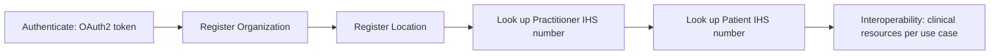

# SATUSEHAT overview

Source: `docs/reference/claude/satusehat-overview.md` (sources: `raw/satusehat/playbook-preface.md`, `playbook-introduction.md`, `playbook-service.md`, `glossary.md`, `fhir-index.md`, `fhir-framework.md`, `fhir-prerequisites.md`, `fhir-resources-index.md`).

## Why this matters for the admin / doctor / patient / device system

SATUSEHAT (also called SSP, SATUSEHAT Platform) is Indonesia's national Health Information Exchange (HIE): it is the outside system our server must speak to (or at least be compatible with in shape). Everything in this project — which resources exist, what a "visit" looks like, which identifiers a patient or doctor carries — is downstream of SATUSEHAT's design choices. For the admin, it fixes the onboarding order (Organization, then Location, then Practitioner, then Patient) before any clinical data can flow. For the doctor and patient roles, it fixes what a "patient" and a "practitioner" identity even are (an IHS Number). For the device system, it fixes the technology (HL7 FHIR over HTTPS REST) our device-sourced Observations must eventually be shaped like.

## What SATUSEHAT is

SATUSEHAT is described in the playbook as an "ekosistem pertukaran data kesehatan" (health-data exchange ecosystem) — a Health Information Exchange connecting fasyankes (fasilitas pelayanan kesehatan, health facilities), regulators, payers (penjamin), and digital-service providers. It sits under Indonesia's Cetak Biru Transformasi Digital Kesehatan 2024 (Digital Health Transformation Blueprint), published at dto.kemkes.go.id.

The problem it is solving, as the playbook frames it: more than 400 government health applications exist without integrating with each other, data gets collected multiple times, metadata is not uniform, and there is no shared interoperability standard. SATUSEHAT's answer is to standardise business process, data, technical, and security specifications; to let any programming language participate via HL7 FHIR and an HTTPS REST API; and to issue a single national identifier — the **nomor SATUSEHAT** (SATUSEHAT number) — that ties together a patient's health information across every facility that treats them.

SATUSEHAT offers four services: the Master Patient Index (MPI, look up a patient's SATUSEHAT number from their NIK — Nomor Induk Kependudukan, national ID number — and/or demographics), the Master SDMK (look up a health worker's IHS number the same way), Patient Registration (send visit data), and Submit Patient Diagnostic Data.

Behind these services sit several master data indexes, each validated against a different national source: MPI (patients, validated against Dukcapil, the civil registry), Master SDMK / MNI (nakes — tenaga kesehatan, health workers — credentials like STR and SIP), MSI (35 facility types, compiled from systems like SISDMK, SIRS, SIMADA), Kamus KFA (the drug/device dictionary, sourced from BPOM and LKPP), plus separate data on financing (Data Pembiayaan) and services (Data Layanan).

## FHIR version and where the standard comes from

No page in the raw corpus states a FHIR version number in so many words. The evidence is indirect: the API base path is `/fhir-r4/v1`, and profile canonicals look like `https://fhir.kemkes.go.id/r4/StructureDefinition/<Resource>`. Both point at FHIR R4, which is why this whole compilation treats SATUSEHAT as an R4 profile set. HL7 FHIR itself stands for Fast Healthcare Interoperability Resources (pronounced "fire"), maintained by the standards body HL7 (`https://www.hl7.org/fhir/`), and the Indonesian profiles are published separately on Simplifier (the raw pages name it but do not print a URL).

## Onboarding: the order that must happen before any clinical data flows

The prerequisites page numbers its list "4 langkah" (4 steps) but actually prints five:

1. **Autentikasi ke SATUSEHAT** — get an OAuth2 access token.
2. **Registrasi Struktur Organisasi** — POST `Organization` records for each sub-organisation.
3. **Registrasi Struktur Lokasi** — POST `Location` records for each sub-location (room, ward, poli).
4. **Menyimpan Nomor IHS untuk Tenaga Kesehatan** — GET `Practitioner` to obtain each doctor's `{practitioner-ihs-number}`.
5. **Mendapatkan Nomor IHS Pasien** — GET `Patient` per the MPI rules to obtain each patient's `{patient-ihs-number}`.

Only after these five steps does "Interoperabilitas" (integrasi) begin, split into Modul Pelayanan (use case dasar — basic service modules, e.g. rawat jalan/outpatient) and Modul Penerapan (use case tematik — disease-specific use cases, e.g. ANC, TB, Gizi).

For our server, this onboarding order becomes the seeding order for the admin role: Organization → Location → Practitioner → Patient, before any Encounter can exist.

## The 46 resources SATUSEHAT lists

The playbook's resource index names 46 resource types it says are used for interoperability, printed verbatim even though two of them — `BillingStatus` and `ChargeItemResponse` — are not FHIR R4 resource names:

`Account`, `AllergyIntolerance`, `BillingStatus`, `CarePlan`, `ChargeItem`, `ChargeItemDefinition`, `ChargeItemResponse`, `Claim`, `ClaimResponse`, `ClinicalImpression`, `Composition`, `Condition`, `Coverage`, `CoverageEligibilityRequest`, `CoverageEligibilityResponse`, `DiagnosticReport`, `DocumentReference`, `Encounter`, `Endpoint`, `EpisodeOfCare`, `FamilyMemberHistory`, `Goal`, `ImagingStudy`, `Immunization`, `Invoice`, `Location`, `Medication`, `MedicationAdministration`, `MedicationDispense`, `MedicationRequest`, `MedicationStatement`, `NutritionOrder`, `Observation`, `Organization`, `Patient`, `PaymentNotice`, `PaymentReconciliation`, `Practitioner`, `Procedure`, `QuestionnaireResponse`, `RelatedPerson`, `RiskAssessment`, `ServiceRequest`, `Specimen`, `Substance`, `Task`.

Some further resources are referenced elsewhere in the corpus but are not on this list: `PractitionerRole` (API page only), `Bundle` (framework page, search results), `OperationOutcome` (error responses), `Device`/`DeviceMetric` (as `Observation.device` targets — directly relevant to our device system), `Consent`, `Provenance`, `Communication`, `Appointment`, and others appearing only in the Standar Terminologi changelog.

Our server only needs a subset of this list: the eight SATUSEHAT resources file 03 covers in detail (Patient, Practitioner, RelatedPerson, Organization, Location, Encounter, Observation, Condition, Procedure), plus a new Device profile for vital-sign hardware.

## Playbook conventions worth memorising

The Pengantar Teknis (technical preface) fixes a vocabulary and a set of formats used throughout every playbook page:

- **Priority keywords** (an Indonesian version of RFC 2119): **WAJIB** = MUST, **TIDAK BOLEH** = MUST NOT, **SEBAIKNYA** / **DIREKOMENDASIKAN** = SHOULD, **SEBAIKNYA TIDAK** / **TIDAK DIREKOMENDASIKAN** = SHOULD NOT, **BOLEH** / **OPSIONAL** = MAY, and **PERLU** used loosely for "needs to."
- **Symbol conventions**: `string` is written `""`; `number` is a numeric string; `uuid` is 36 characters (32 hex digits + 4 hyphens), e.g. `123e4567-e89b-12d3-a456-426614174000`.
- **HTTP methods**: `GET` read, `POST` create, `PUT` update, `PATCH` partial update, `DELETE` delete.
- **HTTP status codes** the playbook names: `200`, `201` (with a `location` header), `202`, `204`, `206` for success; `400`, `401`, `403`, `404`, `405`, `409`, `413`, `415`, `422`, `429` (rate limiter) for client errors; `500`, `501`, `503`, `504` for server errors.
- **ISO 8601 dates/times**: `YYYY`, `MM`, `DD`, `hh` (00–23), `mm`, `ss` (00–60), fractional seconds `.sss` or `.ssssss`; `Z` or `+0000` means UTC. As an example, `10:10:58Z` corresponds to `17:10:58+0700` Asia/Jakarta (WIB) time.
- **Admonition labels**: Catatan (note), Tips, Penting (important), Perhatian (attention), Peringatan (warning).

Reusing this vocabulary (wajib/tidak boleh, the same HTTP status mapping) in our own server's error text and specs keeps them directly comparable to the playbook.

## The FHIR framework, restated by the playbook

The playbook's own framework page restates a few core FHIR JSON shapes:

- An **Element**'s value sits in `{nama_element}`; its `id` and `extension[]` sit in a sibling `_{nama_element}` object for primitive types. Non-primitive types instead carry `id`/`extension` inline. Repeated primitives become parallel arrays, with `null` used as a placeholder where an entry has no value but its sibling `_` array needs an entry.
- A **Resource** always carries `resourceType`, `id`, `meta` (of type Meta), `implicitRules` (a uri), and `language` (a code from the ValueSet of languages).
- A **DomainResource** — the base of almost every clinical resource — adds `text` (a Narrative, i.e. XHTML), `contained[]` (resources embedded inline), `extension[]`, and `modifierExtension[]`.
- A **Bundle** carries `identifier`, `type` (a BundleType), `timestamp`, `total` (wajib for search results), `link[]` (`{relation, url}`), `entry[]` (with `link`, `fullUrl`, `resource`, `search {mode, score}`, `request {method, url, ifNoneMatch, ifModifiedSince, ifMatch, ifNoneExist}`, `response {status, location, etag, lastModified, outcome}`), and `signature`. Bundles are used for search results, resource history, messaging, documents, transactions, and plain collections.

Our server should implement `Bundle` type `searchset` (with `total` and `link`) on every search endpoint, and return `OperationOutcome` for every error, matching this framework exactly.

## Glossary of terms used throughout this compilation

| Term | Gloss |
|---|---|
| SATUSEHAT | National HIE platform (also "SSP", SATUSEHAT Platform) |
| IHS | Indonesia Health Services — issuer of IHS Numbers |
| NIK | Nomor Induk Kependudukan — national ID number on the KTP (ID card) |
| Dukcapil | Kependudukan dan Catatan Sipil — the civil registry that validates NIK |
| MPI / MNI / MSI | Master Patient Index / Master Nakes (health-worker) Index / Master Sarana (facility) Index |
| SDMK, SISDMK | Sistem Informasi Sumber Daya Manusia Kesehatan — health-workforce information system |
| Nakes | Tenaga kesehatan (health worker); STR = Surat Tanda Registrasi, SIP = Surat Izin Praktik |
| Fasyankes | Fasilitas pelayanan kesehatan (health facility); RS = rumah sakit (hospital); Puskesmas = community health centre |
| RME | Rekam Medis Elektronik — electronic medical record |
| KFA | Kamus Farmasi dan Alat Kesehatan — drug/device dictionary (BPOM, LKPP sources) |
| KPTL | Kode Pembiayaan Tindakan dan Layanan Kesehatan Nasional — national billing/procedure code |
| SIRS, SIMADA | Sistem Informasi Rumah Sakit; Sistem Informasi Manajemen Data Kefarmasian |
| Modul Pelayanan / Penerapan (Use Case) | Service module (e.g. Rawat Jalan, Rawat Inap) / disease-specific use case (e.g. ANC, Gizi) |
| Rawat jalan / rawat inap / IGD | Outpatient / inpatient / emergency department |
| Wajib | Mandatory (the `*` marker used throughout the SATUSEHAT resource files) |
| Kamus | Dictionary; Kamus Validasi = validation-rule dictionary |
| Pemetaan Nilai / Pemetaan Variabel | Value mapping / variable mapping (the per-resource element lists in the playbooks) |
| Lampiran | Appendix |
| BPOM, LKPP | Badan Pengawas Obat dan Makanan (food/drug regulator); Lembaga Kebijakan Pengadaan Barang dan Jasa (procurement policy body) |

## Notes carried forward for our server design

- Advertise ourselves as FHIR R4 (base path `/fhir-r4/v1`, profiles under a `.../r4/StructureDefinition/` canonical) since that is the only version evidence the playbook gives.
- Onboarding order for admin seeding: Organization → Location → Practitioner → Patient, before any Encounter.
- Support GET/POST/PUT/PATCH (the preface lists DELETE too, but no resource page in the corpus actually uses it), mapping failures onto the status codes above (`400`/`422` validation, `401`/`403` auth, `404` not found, `409` duplicate, `429` rate limit).

Read next: `02-satusehat-identifiers.md`
