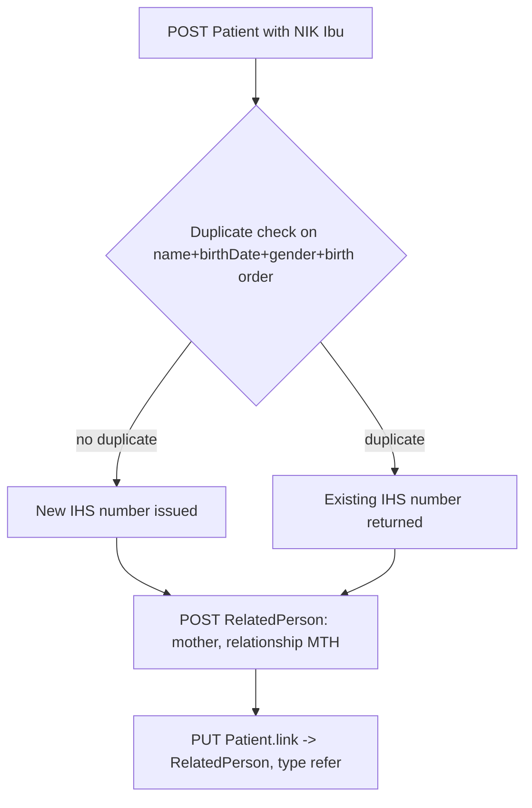

# SATUSEHAT identifiers and master data

Source: `docs/reference/claude/satusehat-identifiers-and-master-data.md` (sources: `raw/satusehat/master-index.md`, `mpi-preliminary.md`, `mpi-pasien-nik.md`, `mpi-pasien-no-nik.md`, `mpi-pasien-bayi.md`, `mpi-rest-api.md`, `msi-preliminary.md`, `msi-rest-api.md`, `wilayah-preliminary.md`, `res-patient.md`, `api-patient.md`, `api-practitioner.md`, `res-related-person.md`).

## Why this matters for the admin / doctor / patient / device system

Every resource in this project ultimately hangs off an identifier issued somewhere in this file: a patient's IHS Number, a practitioner's IHS Number, a facility's `kode_satusehat`. For the admin role, this is the master-data layer to seed and validate: organisations, locations, and the identifier system URIs that must appear on every `Identifier.system` field. For the doctor and patient roles, this is what makes an account theirs — a Patient or Practitioner record keyed by a real identifier, not just a login. For the device system, correct identifiers on `Observation.subject` and `Observation.encounter` are what let a reading trace back to a real person's real visit.

## Master data products

SATUSEHAT maintains four national master indexes:

| Product | What it holds | Validated against |
|---|---|---|
| Master Patient Index (MPI) | Standard patient data | Dukcapil (civil registry) |
| Master Sarana Index (MSI) | Standard facility data — "35 jenis Fasilitas Pelayanan Kesehatan" (35 facility types) | SISDMK, SIRS, SIMADA |
| Master Wilayah | Province, city/regency, district, village codes | Kemendagri RI (Ministry of Home Affairs) |
| Kamus Farmasi dan Alat Kesehatan (KFA) | Drug and medical-device dictionary | BPOM, LKPP |

Two of the corpus's own preliminary pages (`msi-preliminary`, `wilayah-preliminary`) are pure prefaces with no rules or endpoints, and there is no Master Wilayah REST API page in the raw corpus at all — region codes are only inferable from what MPI/MSI print (see below).

## The IHS Number and identifier system URIs

The **IHS Number** (Indonesia Health Service Number) is "nomor urut yang akan dihasilkan oleh IHS untuk setiap record" — a sequence number IHS generates for every record: patients, health workers, facilities, medical devices. It exists because Dukcapil's API is now limited to NIK-validity checks (no autofill), and because some people have no NIK at all — newborns, Indonesians living abroad, foreigners (WNA), and unregistered persons.

Every resource that references a patient elsewhere in this project needs that patient's `{patient-ihs-number}`. In the raw examples the format looks like `P02478375538` (a letter `P` plus 11 digits) for patients, `N10000001` for practitioners, and a 10-digit `kode_satusehat` (e.g. `1000201991`) for facilities — but no format rule is stated anywhere, so these are observed shapes, not a spec.

The identifier system URIs that appear verbatim across the corpus:

| Purpose | System URI |
|---|---|
| NIK of the patient | `https://fhir.kemkes.go.id/id/nik` |
| NIK Ibu (mother's NIK) — for a newborn without their own NIK | `https://fhir.kemkes.go.id/id/nik-ibu` |
| IHS Number of the patient (server-issued; also the resource `id`) | `https://fhir.kemkes.go.id/id/ihs-number` |
| Search-parameter form for the patient IHS number (stated once, on the Patient profile page) | `https://fhir.kemkes.go.id/id/patient-ihs-number` |
| Passport (paspor) | `https://fhir.kemkes.go.id/id/paspor` |
| Kartu Keluarga (family card, KK) | `https://fhir.kemkes.go.id/id/kk` |
| Faskes-local identifiers of other resources (encounter, condition, procedure, location, organization…) | `http://sys-ids.kemkes.go.id/<resource>/{organization-ihs-number}` (exact suffix varies per resource) |

**A contradiction worth stating plainly, not resolving**: the Patient profile page (`res-patient`) gives `https://fhir.kemkes.go.id/id/patient-ihs-number` as the search-identifier system, while the MPI REST API page's own search-response example shows the stored identifier using `https://fhir.kemkes.go.id/id/ihs-number`. Both are quoted verbatim in the playbook; our server should accept both spellings as a search alias rather than pick one as "correct."

## MPI minimum data per patient kind

The MPI recognises three kinds of patient record, each with its own minimum-data rule (`*` marks wajib/mandatory; every kind requires records be unique — no duplicates):

| Data point | Pasien dengan NIK | Bayi baru lahir (newborn) | Tanpa NIK (search only) |
|---|---|---|---|
| identifier | `*` NIK only | `*` NIK or NIK Ibu | — |
| name | `*` full name per KTP | `*` family+given, or generic `Bayi Ny. [Nama ibu]` | `*` partial or full name |
| birthDate | `*` `YYYY-MM-DD` | `*` `YYYY-MM-DD` | `*` `YYYY`, `YYYY-MM`, or `YYYY-MM-DD` |
| gender | `*` male/female | `*` male/female | `*` male/female |
| multipleBirthInteger | — | `*` birth order (`0` if not a multiple birth) | returned in response |
| address (+ administrativeCode extension) | `*` | `*` (may use parents' address) | — |
| maritalStatus | optional (`S`/`M`/`W`/`D`) | must be `S` (never married) | returned as `Married`/`unmarried` |
| citizenshipStatus | optional (`WNI`/`WNA`) | optional | — |

For a **newborn**, a `RelatedPerson` (the mother, relationship type `MTH`) is also mandatory: id (server-generated UUID), the related person's and patient's IHS Numbers, relationship type, name, gender, birth date, address, and phone number. The create flow ends by PUT-linking the `RelatedPerson` back onto the mother's own record.



## Create, get, and update flows

**Create (NIK and newborn):** first GET by IHS number or search by NIK — if found, reuse the IHS number; if not, POST. The POST for a NIK-based patient is sent to Dukcapil for verification against NIK, full name, birth date, gender, and the province/city/district/village codes; if everything matches, a new IHS Number is returned, otherwise an error names the specific unverified field. Defaults applied: status kematian (death status) False, kewarganegaraan (citizenship) WNI, language Indonesian.

**Get options** — four search modes plus lookup by id:

- By ID: the patient's Nomor IHS.
- Search NIK: NIK alone.
- Search Name + Birthdate + NIK.
- Search Name + Birthdate + Gender — name must be at least 3 characters (similar-case match), birthdate exact `YYYY-MM-DD`, gender exact; this is the *only* option available for a patient without a NIK.
- Newborn by NIK Ibu, or via the mother's RelatedPerson list.

**Update/Patch** is allowed only when Dukcapil holds newer data than MPI, or for a newborn not yet Dukcapil-validated. Updatable fields: full name, birth date, birth place, gender, address, marital status, citizenship (plus NIK itself, for newborns). Every PATCH must carry the Nomor IHS plus the existing name/birth date/gender for validation.

### Worked example — MPI REST API call and response shape

```
POST {oauth2}/accesstoken
Content-Type: application/x-www-form-urlencoded
grant_type=client_credentials&client_id=...&client_secret=...

-> { "token_type": "BearerToken", "access_token": "...", "expires_in": 3599 }
```

```
GET /Patient?identifier=https://fhir.kemkes.go.id/id/nik|9271060312000001
Authorization: Bearer <access_token>

-> Bundle (type: searchset), total: 1, entry[0].resource:
   Patient { identifier: [ihs-number, nik], link: [{ other: RelatedPerson/{uuid} }],
             meta.profile: [".../StructureDefinition/Patient"] }
```

One Client ID may be used by only one Organization ID; a mismatch returns `"text": "resource cannot be accessed due to business rule"`. Sandbox base is `https://api-satusehat-stg.dto.kemkes.go.id/fhir-r4/v1`, production is `https://api-satusehat.kemkes.go.id/fhir-r4/v1`.

## Facility (MSI) lookup

The MSI REST API (`GET /v1/mastersaranaindex/mastersarana`) is shared by all facility types — Multi Sarana, Rumah Sakit (hospital), Klinik, PUSKESMAS, Praktik Mandiri all use the *same* endpoint and response shape, differing only in the `jenis_sarana` (facility-type) code passed:

| `jenis_sarana` | Facility type |
|---|---|
| `104` | Rumah sakit (hospital) |
| `103` | Klinik |
| `102` | PUSKESMAS |
| `101` | Praktek mandiri (independent practice) |

Query parameters (`*` wajib): `*limit` (error if > 2000), `*page`, `*jenis_sarana`, plus optional `kode_satusehat`, `kode_sarana`, `nama`, region codes, `status_aktif`, `status_sarana`, source/identifier pairs, and date bounds. A response item carries `kode_satusehat` (the 10-digit SATUSEHAT facility code), name, contact info, coordinates, and nested `provinsi`/`kabkota`/`jenis_sarana`/`subjenis`/`kelas_sarana` objects.

A few internal inconsistencies are recorded here rather than silently fixed: the query docs list `status_sarana` values `draft, verified, valid, reverified` while the response docs list `draft, review, verified, valid`; `provinsi.kode`/`kabkota.kode` are typed `number` in the structure block but described as `string` in the notes and actually returned as strings (e.g. `"96"`); and the auth text says `client_server` where it clearly means `client_secret`.

## Region (wilayah) codes

No dedicated Master Wilayah API page exists in the corpus. What can be inferred from MPI/MSI pages:

| Level | Format | Example |
|---|---|---|
| Provinsi | Kemendagri code, 2 digits | `35`, `96` |
| Kabupaten/Kota | 4 digits | `3603`, `9605` |
| Kecamatan | 6 digits | `350105` |
| Desa/Kelurahan, RT, RW | Required in a Patient's `address-extension`; no digit count is stated | — |

## Notes carried forward for our server design

- Model patient identifiers as a list with systems `nik`, `nik-ibu`, `ihs-number`, `paspor`, `kk`, and accept `patient-ihs-number` as a search alias.
- Newborns: allow `nik-ibu` as the sole identifier, require `multipleBirthInteger` (0 for singleton), force `maritalStatus` `S`, duplicate-check on name+birthDate+gender+birth order, and auto-create a `RelatedPerson` (`MTH`) with a `Patient.link` (`type: refer`) back to it.
- We have no Dukcapil connection of our own: treat NIK as syntactically validated only, and record that the playbook's "verified against Dukcapil" state is unreachable locally.
- Store `kode_satusehat` (10 digits) as our Organization's IHS number and `jenis_sarana` (101–104) as its type code; region codes as 2/4/6-digit Kemendagri strings.
- Reuse the MPI PATCH contract everywhere: JSON Patch, `op: replace` only.

Read next: `03-satusehat-resources.md`
