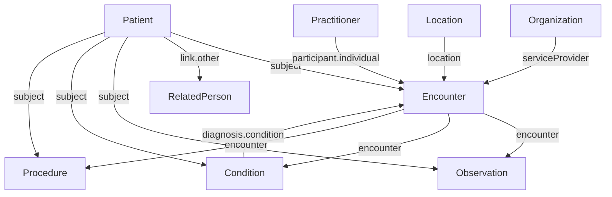
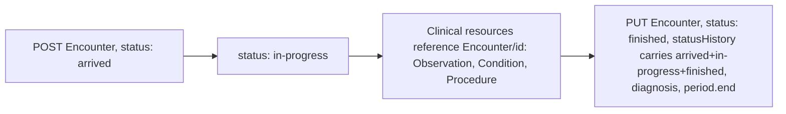

# SATUSEHAT resources

Source: `docs/reference/claude/satusehat-patient.md`, `satusehat-practitioner.md`, `satusehat-related-person.md`, `satusehat-organization-location.md`, `satusehat-encounter.md`, `satusehat-observation.md`, `satusehat-condition.md`, `satusehat-procedure.md` (each file's own `## Sources` lists the underlying `raw/satusehat/res-*.md` and `api-*.md` pages).

## Why this matters for the admin / doctor / patient / device system

These eight resources are the actual building blocks of the server: Patient and RelatedPerson are the patient role's identity, Practitioner is the doctor role's identity, Organization and Location are what the admin role sets up, and Encounter, Observation, Condition, and Procedure are the clinical record a visit produces — including the vital-sign readings the device system posts. Every later design decision (which fields are mandatory, which reference which) traces back to the "wajib" (mandatory) markers on these profile pages.

## How the eight resources connect



Encounter is the hub: almost every clinical resource points back at it, and it points back at Patient, Practitioner, Location, and Organization.

## Patient

`Patient` is keyed by the `{patient-ihs-number}` issued by the Master Patient Index (a facility looks it up with GET, or creates it with POST) and is then referenced as `Patient/{patient-ihs-number}` everywhere else. The profile marks `identifier`, `name`, and `multipleBirth[x]` as wajib at the top level, plus `communication.language` inside any `communication` block and `link.other`/`link.type` inside any `link`. Search supports four modes: identifier token (NIK), name+birthdate+NIK, name+birthdate+gender, and newborn-by-mother's-NIK. There is no PUT documented for Patient — only GET, POST, and PATCH (JSON Patch, `replace` only).

```json
{
  "resourceType": "Patient",
  "identifier": [ { "use": "official", "system": "https://fhir.kemkes.go.id/id/nik", "value": "################" } ],
  "name": [ { "use": "official", "text": "John Smith" } ],
  "gender": "female",
  "birthDate": "1945-11-17",
  "multipleBirthBoolean": false,
  "address": [ { "use": "home", "city": "Jakarta", "country": "ID",
    "extension": [ { "url": "https://fhir.kemkes.go.id/r4/StructureDefinition/administrativeCode",
      "extension": [ { "url": "province", "valueCode": "10" }, { "url": "village", "valueCode": "1010101101" } ] } ] } ]
}
```

## Practitioner (and PractitionerRole)

`Practitioner` is a nakes (health-worker) record keyed by `{practitioner-ihs-number}` from the Master Nakes Index — a faskes only **reads** it (GET search / GET by id); it cannot create one, since there is no MNI on our side. The only wajib element the profile page marks is `qualification.code` (with at least one `coding`) inside any `qualification` entry. `PractitionerRole` has **no profile page at all** in the raw corpus — only a Katalog API page describing search/read/create/update/patch — so its element rules cannot be derived from the playbook and fall back to plain FHIR R4.

```json
{
  "resourceType": "Practitioner",
  "id": "N10000001",
  "identifier": [ { "system": "https://fhir.kemkes.go.id/id/nik", "value": "################" } ],
  "name": [ { "text": "dr. Alexander" } ],
  "gender": "male",
  "qualification": [ { "code": { "coding": [ { "code": "..." } ] } } ]
}
```

For our server, a doctor-role account maps to a Practitioner (identity) plus a PractitionerRole (its link to our single Organization). Because SATUSEHAT treats Practitioner as read-only master data, our server — lacking an MNI of its own — must let the admin role create Practitioners directly.

## RelatedPerson

`RelatedPerson` records someone connected to a patient — most commonly a newborn's mother. Only `patient` (a Reference to the Patient) and, inside any `communication` block, `communication.language` are marked wajib. **There is no Katalog API page for RelatedPerson at all** — the only evidence it exists as an addressable resource is that `Patient.link.other` points at `RelatedPerson/{uuid}` with `type: refer` in the Patient search response. (The RelatedPerson profile page itself opens with an evident copy-paste error — it says data can be sent via the `Observation` resource, plainly meant to say RelatedPerson.)

```json
{
  "resourceType": "RelatedPerson",
  "identifier": [ { "system": "https://fhir.kemkes.go.id/id/nik", "value": "################" } ],
  "patient": { "reference": "Patient/P02029102701" },
  "relationship": [ { "coding": [ { "system": "http://terminology.hl7.org/CodeSystem/v3-RoleCode", "code": "NMTH", "display": "natural mother" } ] } ]
}
```

Because there is no documented endpoint set, our server exposes plain FHIR R4 CRUD for RelatedPerson locally, and may model a guardian/parent patient-role account as a RelatedPerson linked to a child Patient — mirroring the newborn use case.

## Organization and Location

A faskes's parent organisation (organisasi induk) receives its `{organization-ihs-number}` from Kemenkes at registration, then POSTs its suborganisations (hierarchy via `partOf`, wajib once a record is a suborganisation) and its physical places (`Location`, hierarchy via `partOf`, ownership via `managingOrganization`). Location additionally marks `position.longitude`/`position.latitude` wajib whenever `position` is present, and `extension.serviceClass` (ward class: Kelas 1/2/3, VIP, VVIP) wajib.

One inconsistency worth noting rather than resolving: the worked example on both pages gives RSUD Jati Asih the IHS number `100000004`, but the JSON in the same example references `Organization/10000004` — one digit fewer.

```json
{ "resourceType": "Organization", "identifier": [ { "system": "http://sys-ids.kemkes.go.id/organization/1000079374", "value": "Pos Imunisasi LUBUK BATANG" } ],
  "name": "Pos Imunisasi", "partOf": { "reference": "Organization/10000004" } }
```
```json
{ "resourceType": "Location", "status": "active", "name": "Ruang 1A IRJT", "mode": "instance",
  "managingOrganization": { "reference": "Organization/10000004" },
  "partOf": { "reference": "Location/4adccec5-776d-435e-9ac5-98763cb216bb" } }
```

For our single-faskes server, the admin role creates the root Organization and any suborganisations, plus every Location (rooms, wards, poli).

## Encounter

`Encounter` records a kunjungan (visit): when it started and ended, which nakes served the patient, which patient, plus diagnoses and location. It is the hub every clinical resource references. The profile marks a long list wajib: `identifier`, `status`, `statusHistory.status`/`statusHistory.period` (start and end both wajib), `class`, `classHistory.class`/`classHistory.period`, `subject`, `period`, `diagnosis.condition`/`diagnosis.use`/`diagnosis.rank`, `location`, and `serviceProvider`. A finished visit's `statusHistory` must carry all three of `arrived`, `in-progress`, and `finished`.



```json
{
  "resourceType": "Encounter",
  "identifier": [ { "system": "http://sys-ids.kemkes.go.id/encounter/10000004", "value": "P20240001" } ],
  "status": "arrived",
  "class": { "system": "http://terminology.hl7.org/CodeSystem/v3-ActCode", "code": "AMB", "display": "ambulatory" },
  "subject": { "reference": "Patient/100000030009" },
  "participant": [ { "individual": { "reference": "Practitioner/N10000001" } } ],
  "period": { "start": "2022-06-14T07:00:00+07:00" },
  "location": [ { "location": { "reference": "Location/408ba28c-3115-4df5-85c6-60f15b44e7fa" } } ],
  "serviceProvider": { "reference": "Organization/1000004" }
}
```

Only `?subject=<patient-id>` is a documented search parameter; our doctor/patient views will need `date`/`status` filters as a local extension.

## Observation

`Observation` carries hasil pemeriksaan (examination results) — this is the resource the device system's vital-sign readings become. Only four elements are wajib at the top level: `status`, `code` (with at least one `code.coding`), `subject`, and `encounter`; inside any `component`, `component.code` is also wajib. Vital-sign readings use `category` code `vital-signs` (system `http://terminology.hl7.org/CodeSystem/observation-category`), `code` from LOINC, and quantities in UCUM. `device` may reference a `Device`/`DeviceMetric` resource — directly relevant to how our device-sourced readings should be modelled.

```json
{
  "resourceType": "Observation",
  "status": "final",
  "category": [ { "coding": [ { "system": "http://terminology.hl7.org/CodeSystem/observation-category", "code": "vital-signs", "display": "Vital Signs" } ] } ],
  "code": { "coding": [ { "system": "http://loinc.org", "code": "8867-4", "display": "Heart rate" } ] },
  "subject": { "reference": "Patient/100000030009" },
  "encounter": { "reference": "Encounter/2823ed1d-3e3e-434e-9a5b-9c579d192787" },
  "valueQuantity": { "value": 80, "unit": "beats/minute", "system": "http://unitsofmeasure.org", "code": "/min" }
}
```

The identifier system is ambiguous in the source itself: the text says `http://sys-ids.kemkes.go.id/organization/{organization-ihs-number}` while the JSON example on the same page uses `http://sys-ids.kemkes.go.id/observation/1000001`. Our server should accept both rather than pick one.

## Condition

`Condition` carries one ICD-10-coded diagnosis — one Condition payload equals one ICD-10 code, so two diagnoses become two Conditions. Only `code`, `subject`, and `encounter` are wajib. ICD-10 (versi 2010) is used for the visit diagnosis; the discharge condition instead uses `http://terminology.kemkes.go.id/CodeSystem/clinical-term`.

```json
{
  "resourceType": "Condition",
  "code": { "coding": [ { "system": "http://hl7.org/fhir/sid/icd-10", "code": "C47.0", "display": "Malignant neoplasm, peripheral nerves of head, face and neck" } ] },
  "subject": { "reference": "Patient/100000030009" },
  "encounter": { "reference": "Encounter/2b2d0a3e-082a-4fe9-ae13-da9c3b5e422f" }
}
```

## Procedure

`Procedure` reports a tindakan/prosedur medis (medical action) — diagnostic or therapeutic, non-invasive or invasive — coded with **ICD-9 CM**, not ICD-10. Wajib: `status`, `code` (+ `code.coding`), `subject`, `encounter`, and, conditionally, `performer.actor` (whenever a `performer` entry exists) and `focalDevice.manipulated` (whenever a `focalDevice` entry exists).

```json
{
  "resourceType": "Procedure",
  "status": "completed",
  "code": { "coding": [ { "system": "http://hl7.org/fhir/sid/icd-9-cm", "code": "87.44", "display": "Routine chest x-ray, so described" } ] },
  "subject": { "reference": "Patient/100000030009" },
  "encounter": { "reference": "Encounter/2823ed1d-3e3e-434e-9a5b-9c579d192787" },
  "performer": [ { "actor": { "reference": "Practitioner/N10000001" } } ]
}
```

## Notes carried forward for our server design

- Reject a resource missing any of its wajib top-level elements as listed above; validate sub-element wajib fields (e.g. `diagnosis.condition`/`use`/`rank` inside Encounter, `component.code` inside Observation, `performer.actor` inside Procedure) only when their parent block is present.
- All cross-resource references (`subject` → Patient, `encounter` → Encounter, `performer`/`participant.individual`/`recorder` → Practitioner, `location` → Location, `serviceProvider` → Organization) should be validated to point at an existing resource.
- Practitioner and RelatedPerson creation must be owned by our server (admin role) since we have no MNI to defer to.

Read next: `04-satusehat-api-and-validation.md`
