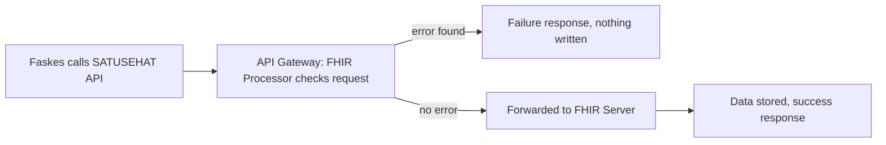

# SATUSEHAT REST API and validation

Source: `docs/reference/claude/satusehat-rest-api-and-validation.md` (sources: `raw/satusehat/api-onboardings.md`, `api-integrations.md`, `api-validasi.md`, `api-kamus-validasi.md`, `api-list-response.md`, `mpi-rest-api.md`).

## Why this matters for the admin / doctor / patient / device system

This file is the shape of the wire protocol: one base URL per environment, one auth header, and one error format. The admin role needs this to set up authentication and monitor error rates. Every role's client (doctor, patient, or a device gateway) will hit the same base path and see the same `OperationOutcome` shape when something goes wrong. Getting error reporting right here means a device that posts a malformed vital-sign reading gets a message it (or the person debugging it) can actually act on.

## Base URLs and authentication

| Purpose | Sandbox | Production |
|---|---|---|
| FHIR resources | `https://api-satusehat-stg.dto.kemkes.go.id/fhir-r4/v1` | `https://api-satusehat.kemkes.go.id/fhir-r4/v1` |
| OAuth2 token | `https://api-satusehat-stg.dto.kemkes.go.id/oauth2/v1` | `https://api-satusehat.kemkes.go.id/oauth2/v1` |

Every request is wajib (must be) authenticated first, with header `Authorization: Bearer <access_token>`. The token itself comes from:

```
POST {oauth2}/accesstoken?grant_type=client_credentials
Content-Type: application/x-www-form-urlencoded
client_id=...&client_secret=...

-> { "token_type": "BearerToken", "access_token": "...", "expires_in": 3599 }
```

Write calls additionally send `Content-Type: application/json`. All examples in the playbook use the sandbox environment. (Both Katalog pages claim the API "mempunyai tiga endpoint," three endpoints, but only list Sandbox and Production — recorded here as written, not corrected.)

## Onboarding versus interoperability

SATUSEHAT splits its resource set into two phases:

- **Orientasi / prerequisites (onboarding)**: `Patient`, `Practitioner` (one raw page spells it "Practicioner"), `Organization`, `Location` — these must exist before any data transaction happens.
- **Interoperabilitas (data transaction)**: every clinical resource, split further into use cases — Modul Pelayanan (basic service modules) and Modul Penerapan (disease-specific use cases). Which API each use case actually needs is documented in the Panduan Interoperabilitas (the interoperability guide), not in the Katalog (API catalogue) itself.

## The validation pipeline



The processor validates terminology codes (ICD-10, ICD-9 CM, LOINC, SNOMED-CT, and other listed FHIR/HL7 code systems) before anything reaches the server, so a bad code never gets persisted.

### The `OperationOutcome` error shape

A `4xx` response body is always an `OperationOutcome`:

```
{ resourceType: "OperationOutcome",
  issue: [ { severity: string, code: string, details: { text: string }, expression: [string] } ] }
```

`issue.severity` is only ever seen as `error`. `issue.code` takes one of three values: `duplicate` (the same encounter sent repeatedly), `format` (wrong format), or `value` (a value not allowed or not matching). `issue.details.text` is a human-readable message, usually carrying `(RuleNumber: NNNNN)`. `issue.expression` names the resource path of the offending field, e.g. `Encounter.serviceProvider`.

### Worked example — a validation failure

```json
{
  "resourceType": "OperationOutcome",
  "issue": [
    {
      "severity": "error",
      "code": "value",
      "details": { "text": "Reference is mandatory : Encounter.serviceProvider (RuleNumber: 10124)" },
      "expression": ["Encounter.serviceProvider"]
    }
  ]
}
```

### Rule numbers the raw pages actually print

The full Kamus Rule Number (rule-number dictionary) is an external spreadsheet not present in the corpus — the table below is the complete set of rule numbers the playbook itself shows:

| RuleNumber | `issue.code` | Message (verbatim) | What triggers it |
|---|---|---|---|
| — | `duplicate` | `Found duplicate resource: Encounter` | A payload sent more than once (TIDAK BOLEH) |
| 10001 | `value` | `Code not found: 'xxx' in system: ... (RuleNumber: 10001)` | Code not in a SATUSEHAT/FHIR HL7 code system |
| 10002 | `value` | `Invalid coding system: http://xxx.org (RuleNumber: 10002)` | `system` not allowed for that element |
| 10117 | `value` | `Invalid identifier system: http://xxx.org (RuleNumber: 10117)` | `Identifier.system` not a valid SATUSEHAT system |
| 10124 | `value` | `Reference is mandatory : Encounter.serviceProvider (RuleNumber: 10124)` | A required reference element is missing |
| 10132 | `format` | `Invalid date time format ... (RuleNumber: 10132)` | Not `YYYY-MM-DDThh:mm:ss+00:00` |
| 10132 | `value` | `Invalid date time value ... Not Allowed : Future Date or Past Date older than ... (RuleNumber: 10132)` | Date outside the allowed window |
| 10134 | `value` | `Text is empty: '' (RuleNumber: 10134)` | An element is an empty string (TIDAK BOLEH) |
| 10171 | `value` | `Use /operationalStatus instead of /operationalStatus/system to patch Location (RuleNumber: 10171)` | Wrong PATCH path on Location |
| 10254 | `value` | `Integer formated as a string: 'Satu' (RuleNumber: 10254)` | Integer sent as a quoted string |
| 10263 | `value` | `Element not found: Claim.insurance[0].focal (RuleNumber: 10263)` | A wajib element is missing |

Note that RuleNumber `10132` is reused for two different `issue.code` values (`format` and `value`) — recorded as printed, not treated as an error in our source.

## The time zone and date-range rules

Standard time format for sending data is **UTC+00**: convert WIB (Western Indonesia Time) by subtracting 7 hours, WITA by 8, WIT by 9. Example: 17:35 WIB on 23 August 2023 is sent as `2023-08-23T10:35:00+00:00`. This exists so a value is not mistakenly detected as a future date; exceptions are allowed for genuinely future events (appointments, drug expiry, insurance validity, "dan lainnya").

**A contradiction to record, not resolve**: `api-list-response.md` states no past date may be older than 31 August 2022, while the Observation profile page (see file 03) states dates must not be earlier than 03 June 2014. Both appear verbatim in the corpus; our server must pick one lower bound and document that choice rather than assume the playbook agrees with itself.

## Response conventions common to every resource's API page

| Status | Content-Type | Body |
|---|---|---|
| 2xx | `application/json` | The resource (create returns an `id` to store) or a `Bundle` of type `searchset` |
| 4xx | `application/json` | `OperationOutcome` |
| 5xx | `text/plain` | e.g. `Gateway Timeout` |

## Notes carried forward for our server design

- Serve everything under one base path shaped like `/fhir-r4/v1`; require `Authorization: Bearer <token>` on every request, and reply `401` with an `OperationOutcome` when it is missing.
- Emit validation failures as `OperationOutcome` with `issue[].severity = error`, `issue[].code` in `{duplicate, format, value}`, `details.text` including `(RuleNumber: N)`, and `expression` as a FHIRPath-style element path — reuse the playbook's rule numbers where our rule matches the same condition, and mint our own numbers for anything new.
- Validate before persisting (processor, then server) so a failed request writes nothing.
- Store and compare instants in UTC; reject dateTimes without a zone; reject future dates except on period-type elements; pick one lower bound for dates and document it, since the corpus gives two.
- Reject duplicate Encounter submissions (same identifier) with `issue.code = duplicate`.

Read next: `05-satusehat-usecase-and-terminology.md`
