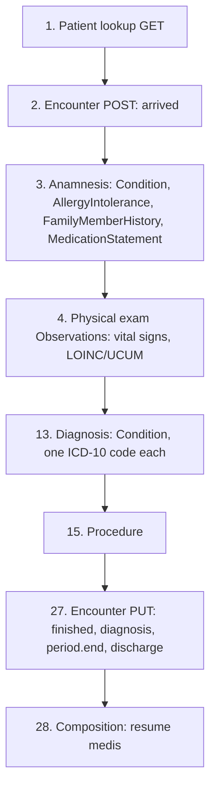

# SATUSEHAT use case (rawat jalan) and terminology

Source: `docs/reference/claude/satusehat-usecase-rawat-jalan.md` (sources: `raw/satusehat/interop-index.md`, `interop-rme-rawat-jalan.md`) and `docs/reference/claude/satusehat-terminology.md` (sources: `raw/satusehat/term-index.md`, `term-standar.md`, `term-loinc.md`, `term-loinc-laboratory.md`, `term-snomed-ct.md`, `term-icd-10.md`, `term-icd-9-cm.md`, `term-lampiran-rawat-jalan.md`, `interop-rme-rawat-jalan.md`, `api-validasi.md`).

## Why this matters for the admin / doctor / patient / device system

The rawat jalan (outpatient) use case is the closest thing the playbook gives to a full worked example of "one visit, start to finish" — it is the template our own visit workflow should follow. For the doctor role, it fixes the order clinical resources get created in and which fields are mandatory at each step. For the device system specifically, step 4 gives the exact LOINC/UCUM codes to use for vital-sign readings — this is the terminology our device gateway must speak. For the admin role, terminology is what has to be seeded into a lookup table before any of this validates.

## The rawat jalan posting order

The Rawat Jalan module (version 6.3, 30 October 2025) defines 28 integration steps for one outpatient visit. After the four onboarding prerequisites (auth, Organization, Location, Practitioner IHS number — see file 01), the sequence runs:



(This diagram collapses the full 28-step list to the resources most relevant to our device/vital-sign scope; steps 5–12 and 16–26 add functional exams, care plans, lab/radiology, pharmacy, diet, education, and follow-up, each referencing back to the Encounter from step 2.)

Every step lists which elements are wajib for that step's resource, generally matching (but sometimes adding to) the profile-level wajib elements from file 03. For example, step 2's Encounter POST additionally lists `statusHistory.status`/`period`, `classHistory.class`/`period`, `participant.type`/`individual`, and `diagnosis.condition` as wajib for this specific use case, beyond the profile's own baseline.

A version history note worth carrying forward: v6.2's changelog says sending `Medication` "separately" (i.e. as two separate POSTs for prescribing and dispensing) "sudah tidak bisa digunakan" (can no longer be used) — yet steps 16 and 18, in the same document, still list "2 kali POST" (two POSTs) as option 1. This is a contradiction inside a single raw file, recorded here rather than resolved.

## Step 4 — vital signs and physical exam (the device system's core table)

All vital-sign Observations use `category` = `vital-signs` (system `http://terminology.hl7.org/CodeSystem/observation-category`), `code.system` = `http://loinc.org`, and `valueQuantity.system` = `http://unitsofmeasure.org` (UCUM):

| Variable | LOINC code | Display | Unit | UCUM code |
|---|---|---|---|---|
| Denyut Jantung (heart rate) | `8867-4` | Heart rate | `beats/min` | `/min` |
| Pernapasan (respiratory rate) | `9279-1` | Respiratory rate | `breaths/min` | `/min` |
| Tekanan Darah Sistole | `8480-6` | Systolic blood pressure | `mm[Hg]` | `mm[Hg]` |
| Tekanan Darah Diastole | `8462-4` | Diastolic blood pressure | `mm[Hg]` | `mm[Hg]` |
| Suhu Tubuh (body temperature) | `8310-5` | Body temperature | `C` | `Cel` |
| Tinggi Badan (height) | `8302-2` | Body height | `cm` | `cm` |
| Berat Badan (weight) | `29463-7` | Body weight | `kg` | `kg` |
| Luas Permukaan Tubuh anak (BSA) | `8277-6` | Body surface area | `m²` | `m²` |

**Oxygen saturation (SpO2) appears nowhere in the corpus** — neither `2708-6` nor `59408-5` is printed on any raw page. If our device system adds SpO2, that LOINC choice is ours to make and must be flagged as a local extension, not a playbook requirement. Systolic and diastolic blood pressure are also separate Observations in this playbook, not `component`s of one Observation — worth noting since FHIR's own Vital Signs profile groups them as components (see file 13).

### Worked example — a heart-rate reading

```json
{
  "resourceType": "Observation",
  "status": "final",
  "category": [ { "coding": [ { "system": "http://terminology.hl7.org/CodeSystem/observation-category", "code": "vital-signs" } ] } ],
  "code": { "coding": [ { "system": "http://loinc.org", "code": "8867-4", "display": "Heart rate" } ] },
  "subject": { "reference": "Patient/100000030009" },
  "encounter": { "reference": "Encounter/2823ed1d-3e3e-434e-9a5b-9c579d192787" },
  "performer": [ { "reference": "Practitioner/N10000001" } ],
  "valueQuantity": { "value": 80, "unit": "beats/minute", "system": "http://unitsofmeasure.org", "code": "/min" }
}
```

A contradiction worth stating: this use-case page marks `Observation.performer` wajib for physical-exam Observations, while the Observation profile page (file 03) does not mark `performer` wajib at all. Our server should decide, and document, which rule it follows for device-sourced vital signs — the use-case rule is the stricter and use-case-specific one.

## Which code system is mandated for what

| Code system | Mandated use | System URI |
|---|---|---|
| ICD-10 (versi 2010) | Diagnosis standard | `http://hl7.org/fhir/sid/icd-10` |
| ICD-9 CM (versi 2010) | Procedure / medical-action naming | `http://hl7.org/fhir/sid/icd-9-cm` |
| LOINC | Laboratory test naming; in practice also vital signs, physical exam, Composition sections | `http://loinc.org` |
| SNOMED CT | Clinical term naming (findings, body structure, procedures, substances…) | `http://snomed.info/sct` |
| KPTL | National billing/procedure code, equivalent to LOINC (lab) or ICD-9 CM (procedures) | `http://terminology.kemkes.go.id/CodeSystem/kptl` |
| KFA | Drug and device codes | `http://sys-ids.kemkes.go.id/kfa` |
| UCUM | Units in every `Quantity` | `http://unitsofmeasure.org` |
| Kemkes local systems | Chief complaint categories, clinical terms, discharge disposition, service class, medication form | `http://terminology.kemkes.go.id/...` |
| HL7 terminology | Status/category value sets | `http://terminology.hl7.org/CodeSystem/...` |

The FHIR Processor (see file 04) validates ICD-10, ICD-9 CM, LOINC, and SNOMED-CT codes on write; an unknown code returns `Code not found` (RuleNumber 10001), a code from the wrong system returns `Invalid coding system` (RuleNumber 10002).

## Diagnosis and code migrations

Diagnosis follows the rule from file 03: one Condition per ICD-10 code, `category` `encounter-diagnosis`. Chief complaint (keluhan utama) is modelled as a separate Condition, with a kemkes-local `category` code `chief-complaint` and a SNOMED CT code (constrained by an ECL query, `< 404684003 |Clinical finding|`).

The terminology appendix records a code migration: version 1.2 of the playbook used Kemkes `clinical-term` codes for several fixed-answer fields (prognosis, discharge condition, level of consciousness, follow-up plan, education topics); version 2.0 (3 May 2023) replaced these with SNOMED CT codes. Both are printed in the corpus, and the current use-case page uses only the SNOMED codes — our server should accept the old Kemkes codes on read (for historical data) but write only SNOMED going forward.

A further contradiction the terminology appendix and the use-case page disagree on: the appendix places the tingkat-kesadaran (level-of-consciousness) SNOMED codes directly on `Observation.code.coding`, while the use-case page (step 4) instead puts LOINC `67775-7` in `Observation.code` and the SNOMED codes in `Observation.valueCodeableConcept`. Both are recorded verbatim; neither is corrected here.

## KFA drug code structure

Drug/device codes are 8 digits with a prefix indicating the product level:

| Prefix | Tag | Meaning | Example |
|---|---|---|---|
| `91` | BZA | Bahan Zat Aktif (active substance) | `91000101` Paracetamol |
| `92` | POV | Produk Obat Virtual (virtual/template product) | Paracetamol 500 mg Tablet |
| `93` | POA | Produk Obat Aktual (actual, branded product) | Paracetamol 500 mg Tablet (Panadol) |
| `94` | POAK | Produk Obat Aktual dalam Kemasan (packaged) | `94002470` |

`MedicationRequest.code` may use `92` or `93` (`91` is invalid there); `MedicationDispense` must use `93`.

## LOINC structure, briefly

LOINC codes are numeric, 3–7 characters with a check digit after a hyphen (`xxxxxx-x`), covering laboratory, radiology, clinical (including vital signs), and standardized-survey scopes. Results carry a scale type: `Qn` (quantitative), `Ord` (ordinal), `OrdQn`, `Nom` (nominal), `Nar` (narrative), among others. When no LOINC code exists yet, a temporary national code is used (prefix `X` + 6 digits, e.g. `X099080`), later replaced once LOINC assigns one.

## Notes carried forward for our server design

- Enforce this dependency order: Organization/Location/Practitioner exist → Patient exists → Encounter POST (`arrived`/`in-progress`, class `AMB`) → clinical resources referencing `Encounter/{id}` → Encounter PUT to `finished` carrying diagnosis, `period.end`, and discharge disposition.
- Vital-sign Observations from devices: one Observation per measurement using the eight LOINC/UCUM pairs above; category `vital-signs`; include `performer` per the use-case page's stricter rule. Document our own SpO2 LOINC choice as a local extension if we add it.
- Diagnosis: one Condition per ICD-10 code, category `encounter-diagnosis`; chief complaint is its own Condition with a kemkes category and SNOMED code.
- Procedures use ICD-9 CM on `Procedure.code`.
- Keep the Kemkes→SNOMED migration table so old codes can still be read and mapped forward.
- Lab, radiology, pharmacy, and Composition are out of scope for the first iteration, but reference fields (`basedOn`, `derivedFrom`, `result`) should stay open for later.

Read next: `10-fhir-basics.md`
