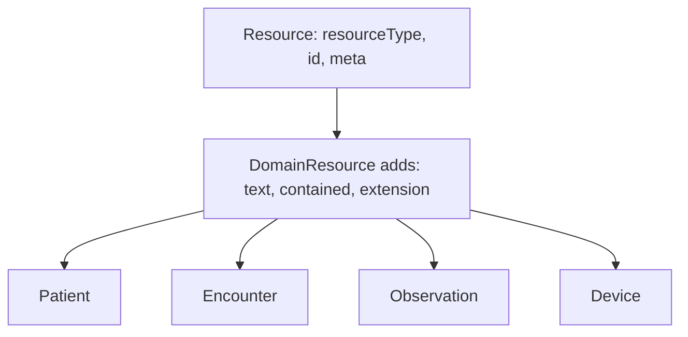

# FHIR R4 basics

Source: `docs/reference/claude/fhir-datamodel-basics.md` (sources: `raw/fhir-r4/datatypes.md`, `references.md`, `narrative.md`, `validation.md`), `docs/reference/claude/fhir-ci-build-notes.md` (sources: `raw/fhir-ci/documentation.md`, `overview-dev.md`).

## Why this matters for the admin / doctor / patient / device system

Every resource our server stores or serves — Patient, Encounter, Observation, the new Device profile — is built out of the same small set of primitive and complex data types, and every cross-resource pointer uses the same `Reference` shape. Get these basics wrong and nothing downstream is trustworthy: a `Quantity` without a UCUM code cannot be compared, a `dateTime` without a time zone cannot be ordered against another facility's records, a `Reference` that does not resolve breaks the device → Observation → Patient chain the whole project exists to support. This file is the vocabulary the rest of the human view assumes.

## R4, not the CI build — read this caveat first

Two of the sources for this file (`fhir-ci-build-notes.md`) come from `https://build.fhir.org/`, which is the **Continuous Integration build of a future FHIR release (R6-ci)** — the page itself warns it "will be incorrect/inconsistent at times." SATUSEHAT is FHIR **R4**, confirmed by its API base path `/fhir-r4/v1` and its profile canonicals under `.../r4/StructureDefinition/...` (see `01-satusehat-overview.md`). The CI pages are kept in this compilation only for orientation — how the spec's documentation is organised, and for statements that happen to hold in both R4 and the CI build (cross-checked against the real R4 pages). Any rule, verb, status code, element name, or cardinality in this project must come from an `fhir-r4/*`-sourced file, never from the CI pages. Where the two disagree — for example the CI walkthrough says paging links are named `first`/`prev`/`next`/`last`/`self`, but R4's own `http.md` says `first`/`previous`/`next`/`last`/`self` — the R4 page wins. R6-only concepts named in the CI index (CanonicalResource, Subscriptions Framework, Implementation Obligations, ND-JSON) have no R4 counterpart and must not appear in our design.

## Primitive types

FHIR JSON primitives store their value directly on the named property; any `id` or extension attached to that primitive goes on a sibling property with an underscore prefix (`"count": 2, "_count": {"extension": [...]}`). An empty string or JSON `null` is never a valid primitive value — if an element has nothing to say, it is simply omitted.

The types that matter most for our server:

| Type | What it is | Notes |
|---|---|---|
| `dateTime` | `YYYY`, `YYYY-MM`, `YYYY-MM-DD`, or a full timestamp with a time zone | A time zone is required whenever hours are given; seconds are required in a full timestamp |
| `instant` | full timestamp, always with seconds and a time zone | used for `meta.lastUpdated` and similar system-managed times |
| `decimal` | arbitrary-precision number | precision is significant — `0.010` is a different value from `0.01`, and this must be preserved, not rounded |
| `code` | a single token, no internal whitespace beyond single spaces | used for every fixed vocabulary (`status`, `gender`, …) |
| `id` | 1–64 characters, letters/digits/`-`/`.`, case sensitive | this is what a resource's own id and the id part of `Type/id` references look like |

A decimal like a vital-sign reading (`80.0` beats/minute) must round-trip exactly through our storage layer, and a `dateTime` we generate must always carry a time zone once it includes a time component.

## The complex types worth knowing by name

`Identifier` (a `system` URI plus a `value`, e.g. a NIK or IHS number), `HumanName`, `Address`, `ContactPoint`, `Coding` (one code from one system), `CodeableConcept` (one or more `Coding`s plus free text), `Quantity` (a `value`, `unit`, and — for anything meant to be machine-comparable — a `system` and UCUM `code`), `Period` (a `start`/`end` pair), and `Reference` (below) appear throughout every resource file in this compilation. `SampledData` — "a series of measurements taken by a device" — is the type a continuous waveform from our vital-sign device would use if we ever need one; a single point-in-time reading just uses `Quantity`.

```json
{
  "resourceType": "Observation",
  "valueQuantity": { "value": 80, "unit": "beats/minute", "system": "http://unitsofmeasure.org", "code": "/min" }
}
```

## Reference: how resources point at each other

A `Reference` element (used by `subject`, `encounter`, `device`, `performer` and every other cross-resource pointer) needs at least one of `reference` (a literal `Type/id` path or full URL), `identifier` (a business identifier, when no literal id is known — a "logical reference"), or `display` (text only, not authoritative). Literal references must actually resolve to a real resource. References are one-directional: pointing from an Observation to a Patient tells you nothing automatically in the other direction, and this relationship is not inherited by anything else that references the Observation. `Encounter.partOf`, `Location.partOf`, `Organization.partOf`, and `Patient.link.other` are examples of references that form a hierarchy or a chain rather than a single link.

```json
{ "reference": "Patient/100000030009" }
```

## Resource anatomy

Every FHIR resource — Patient, Encounter, Observation, our future Device profile — carries `resourceType`, an `id`, and a `meta` block (`versionId`, `lastUpdated`, `profile`, `tag`, `security`). Almost every clinical resource is also a `DomainResource`, which adds `text` (a human-readable narrative, in a constrained subset of XHTML — no scripts, no external stylesheets, no event handlers), `contained` resources (for content with no independent identity of its own), and `extension`/`modifierExtension` lists. A resource can, in principle, be text-only as long as its mandatory elements are still satisfied — the narrative is meant to be a human fallback that stays understandable even if a reader ignores every structured field.



## Validation is layered, and no single method is complete

FHIR names several validation methods — XML Schema, Schema+Schematron, JSON Schema, ShEx, the FHIR Validator jar, and the `$validate` operation — but the source is explicit that all of them are incomplete: a validator cannot machine-check that "all clinically important content is in the narrative," so a human is always the final check on that particular rule. The practical order our server should validate in is structure, then cardinality, then value-domain rules (regexes, enumerated codes), then coding/CodeableConcept bindings against our terminology tables, then invariants, then profile conformance, then business rules (duplicate detection, reference resolution, authorization) — each layer assumes the ones before it already passed.

Read next: `11-fhir-rest-and-search.md`
