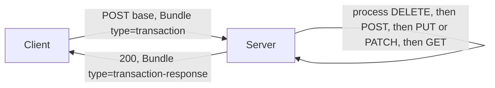

# FHIR R4 REST, search, Bundle, CapabilityStatement

Source: `docs/reference/claude/fhir-rest-api.md` (sources: `raw/fhir-r4/http.md`, `search.md`, `operations.md`, `bundle.md`, `capabilitystatement.md`).

## Why this matters for the admin / doctor / patient / device system

This is the wire protocol every role uses: the admin's onboarding POSTs, the doctor's Encounter/Condition/Procedure writes, the patient's read-only queries of their own record, and the device feed's repeated `POST Observation` calls all go through the same handful of REST "interactions." Getting the interaction table, the search-parameter types, and the Bundle/CapabilityStatement shapes right is what makes our server behave like a FHIR server rather than a bespoke API that happens to speak JSON.

## The interaction set

FHIR defines the same interactions for (almost) every resource type, all rooted at `[base]/[type]`:

| Interaction | Verb + URL | Success | Notes |
|---|---|---|---|
| read | `GET [base]/[type]/[id]` | `200` | should return `ETag` + `Last-Modified` |
| create | `POST [base]/[type]` | `201` | server assigns the `id`; response carries `Location` |
| update | `PUT [base]/[type]/[id]` | `200`/`201` | body's `id` must equal the URL id; supports `If-Match` for optimistic concurrency |
| patch | `PATCH [base]/[type]/[id]` | `200`/`201` | JSON Patch, XML Patch, or FHIRPath Patch |
| delete | `DELETE [base]/[type]/[id]` | `200`/`204`/`202` | |
| search | `GET [base]/[type]{?params}` | `200` + Bundle `searchset` | also `POST [base]/[type]/_search` |
| capabilities | `GET [base]/metadata` | `200` + CapabilityStatement | should be servable even before authentication |
| transaction / batch | `POST [base]` with a Bundle | `200` + response Bundle | atomic vs. best-effort |

```
POST /base/Patient
Authorization: Bearer <token>
Content-Type: application/fhir+json

→ 201 Created
  ETag: W/"1"
  Location: [base]/Patient/f001/_history/1
```

Concurrency uses `ETag`/`If-Match`: a client sends `If-Match: W/"23"` on update, and a mismatch is answered with `412 Precondition Failed`. Errors carry an `OperationOutcome` body, and content negotiation is `application/fhir+json` in and out (a generic `application/json` Accept header is tolerated, but `application/fhir+json` is what servers SHALL use).

## Search

Search parameters have a type (`token`, `string`, `date`, `reference`, `quantity`, `number`, `uri`, `composite`, `special`), each with its own matching rules and modifiers. A `token` search on `Observation?code=8867-4` matches a coded element close to exactly; a `string` search on `Patient?name=john` is case- and accent-insensitive and matches from the start by default; a `date` search accepts prefixes like `ge`/`le` for ranges. Universal parameters available on every resource include `_id`, `_lastUpdated`, `_tag`, `_profile`, `_security`, and `_has` (reverse chaining, e.g. `_has:Observation:patient:code=1234-5`). Chaining lets a search follow a reference: `Encounter?subject.name=peter` searches Encounters by their subject's name.

A worked example straight from the Claude view:

```
GET {base}/Observation?patient=100000030009&category=vital-signs&date=ge2024-01-01
```

Search results come back as a `Bundle` of type `searchset`, with `total` (all matches, not just this page), and `link` entries named `self`, `first`, `previous`, `next`, `last` (note: not `prev` — that spelling only appears in the non-normative CI build orientation notes, see `10-fhir-basics.md`). Result-shaping parameters include `_sort`, `_count`, `_include`/`_revinclude` (pull in referenced or referencing resources in the same Bundle), and `_summary`/`_elements` (return a subset of fields, tagged `SUBSETTED`).

## Bundle types

| Type | Used for |
|---|---|
| `searchset` | search results |
| `history` | resource version history |
| `transaction` / `transaction-response` | an all-or-nothing set of writes |
| `batch` / `batch-response` | a best-effort set of writes, each entry succeeding or failing independently |
| `document`, `message`, `collection` | not needed for a plain REST server |

A `transaction` Bundle processes its entries in a fixed order — deletes, then creates, then updates/patches, then reads — regardless of the order they were listed in, and the whole transaction fails atomically if any entry conflicts. This is the shape our device feed could use to post an Observation together with a conditional reference to the Patient (`"reference": "Patient?identifier=..."`) in one call.



## CapabilityStatement

`GET [base]/metadata` returns a `CapabilityStatement` — the single source of truth for what our server actually supports. "Resource Types or operations that are not listed are not supported." It declares, per resource type, which interactions (`read`, `create`, `search-type`, …), which search parameters, which profiles (`rest.resource.supportedProfile`), and which versioning level (`no-version` / `versioned` / `versioned-update`) we offer, plus the security scheme (`rest.security.service = OAuth`, `cors = true`). Our server should be able to serve this document even to an unauthenticated caller, since it is how a client discovers what is possible before it even logs in.

Read next: `12-fhir-security-and-roles.md`
