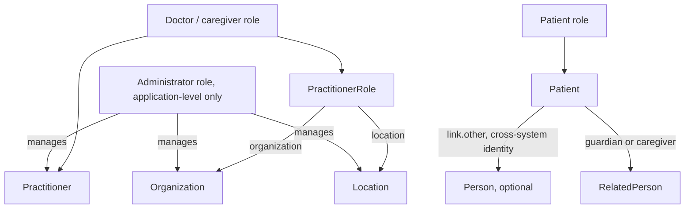

# FHIR R4 security and our three roles

Source: `docs/reference/claude/fhir-security.md` (sources: `raw/fhir-r4/security.md`, `secpriv-module.md`), plus the resource files `fhir-patient-person-relatedperson.md`, `fhir-practitioner-practitionerrole.md` for the role → resource mapping.

## Why this matters for the admin / doctor / patient / device system

FHIR itself is explicit: "FHIR is not a security protocol, nor does it define any security related functionality" and it does not define user, role, or permission resources. That means our three roles — administrator, doctor, patient — and the device feed's own identity are entirely our design, built on top of building blocks FHIR does supply: OAuth-style authentication, security labels, compartments, and the `AuditEvent`/`Provenance` resources. Getting this mapping right up front is what decides who can read or write what, and it is the one part of this compilation where the spec gives principles, not a table to copy.

## Mapping the three roles onto FHIR concepts

| Role | FHIR resource(s) | Notes |
|---|---|---|
| Administrator | *none* — an application-level role, not a FHIR resource | FHIR "does not provide user, profile, or other such administration resources"; the admin's authority (create Organization/Location/Practitioner, manage the terminology and profile tables) exists only in our own access-control layer |
| Doctor / assigned caregiver | `Practitioner` (identity) + `PractitionerRole` (link to our Organization/Location) | authorization for "may this doctor act at this facility" belongs to `PractitionerRole`, not to `Practitioner.qualification` — qualifications imply no authorization by themselves |
| Patient | `Patient` (primary identity); `Person` only if one login must span a Patient record and a linked `RelatedPerson` record (cross-system identity); `RelatedPerson` for a caregiver/guardian acting on the patient's behalf (the Claude view supports this for the newborn-guardian case, where a mother's `RelatedPerson` record is linked back to the child's `Patient`) | `Person` is explicitly said to be an "advanced feature" and "SHALL NOT be referenced by any other clinical or administrative resource" — treat it as optional, not a required part of the patient identity |



## What FHIR does supply: access control, compartments, security labels, audit

FHIR names eleven security topics (time synchronisation, TLS, authentication, authorization/access control, audit, digital signatures, attachments, security labels, jurisdictional data-management policy, narrative handling, input validation) and is explicit that it only supplies *building blocks* for most of them, not a finished mechanism:

- **Authentication.** OAuth is recommended for web-centric access, with SMART-on-FHIR named as a healthcare-specific profile of it and OpenID Connect for identifying the end user. A `CapabilityStatement` can advertise `rest.security.service = OAuth | SMART-on-FHIR | NTLM | Basic | Kerberos | Certificates`.
- **Authorization / access control.** Two named models: RBAC (permissions — Create, Read, Update, Delete, Execute — on resource types, grouped into roles) and ABAC (policies over attributes like security tags, purpose of use, and the relationship between the requesting user and the patient). The source states plainly that "FHIR readily enables RBAC" and gives a checklist every access path must be evaluated against: plain CRUD, chained search, `_include`/`_revinclude` targets, security labels, container resources (does access to a Bundle grant access to its contents?), operations that disclose patient data, and each entry inside a batch/transaction.
- **Compartments.** The spec allows binding the API to one patient's data — for example via a base path or an OAuth login — and mentions `Patient/[id]/[type]` searches as the shape a patient-scoped client would use. This is the natural mechanism for our patient role: read-only access to one's own compartment.
- **Security labels.** Resources carry labels in `meta.security`, searchable with `_security`, which the (external) access-control system uses alongside the resource content to decide whether to allow an operation. Named label vocabularies include confidentiality/sensitivity levels, de-identification labels (`ANONYED`, `MASKED`, `PSEUDED`, `REDACTED`), and `HTEST` for marking test data.
- **AuditEvent.** The spec is emphatic here: "A FHIR server should keep a complete, tamper-proof log of all API access and other security- and privacy-relevant events," and "all uses of FHIR Resources would be security/privacy relevant and thus should be recorded in an AuditEvent." Reads are recorded with `AuditEvent`; creates/updates/deletes get a `Provenance` record. A patient's own "accounting of disclosures" report is meant to be derivable from their `AuditEvent` history.

## Sensitivity classes, for calibrating how much protection each read needs

| Class | Example | Suggested protection |
|---|---|---|
| Anonymous READ | conformance resources | server-authenticated HTTPS only |
| Business sensitive | Organization/Location data | client authentication (mutual TLS, API key, signed JWT) |
| Individual sensitive | Practitioner, PractitionerRole | role-specific access (RBAC/ABAC) |
| Patient sensitive | "the bulk of FHIR" — clinical data | security labels, often governed by `Consent` |

## A worked mapping for our access-denied policy

The spec lists four possible responses to an unauthorized request and what each one leaks:

```json
{
  "200 + empty Bundle": "hides whether any matching patient exists",
  "404 Not Found": "indistinguishable from a non-existent resource, but leaks that authentication succeeded",
  "403 Forbidden": "confirms an authorization failure — only use when the user may know that",
  "401 Unauthorized": "authentication itself failed"
}
```

Read next: `13-fhir-resources-for-monitoring.md`
