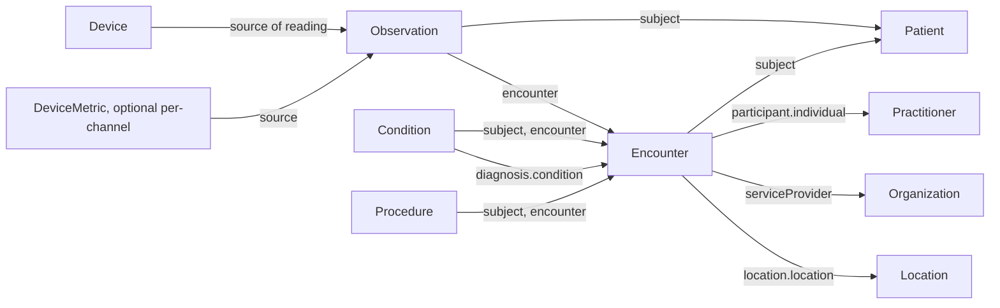
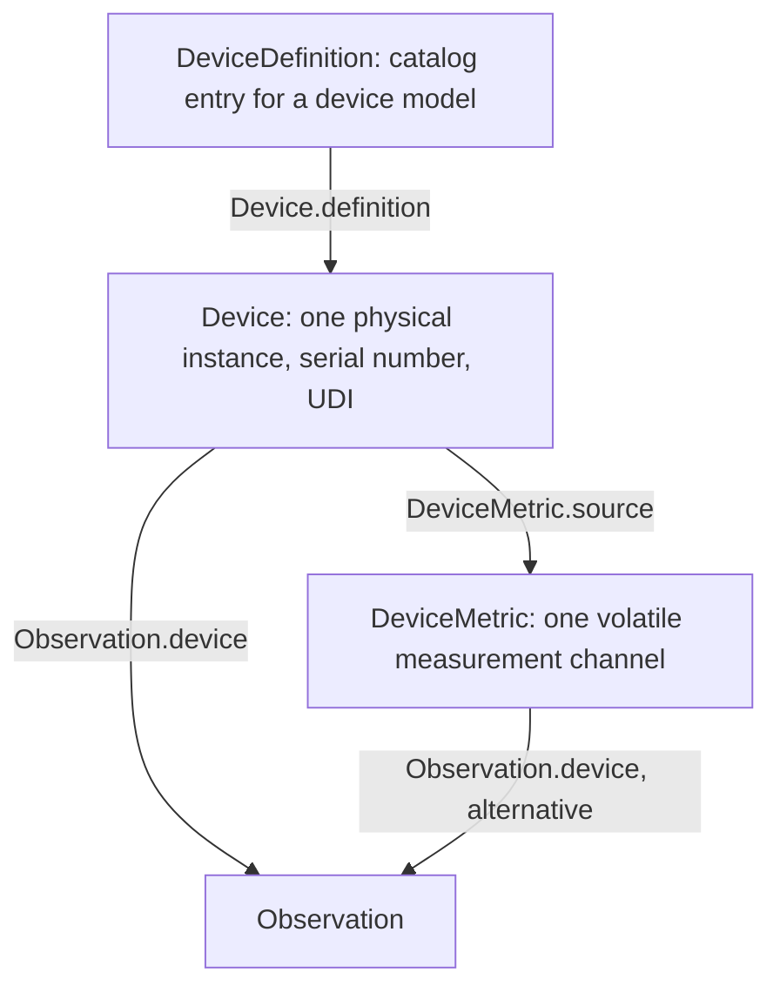

# FHIR R4 resources for device-sourced monitoring

Source: `docs/reference/claude/fhir-observation.md` (incl. Vital Signs profile), `fhir-device.md`, `fhir-encounter.md`, `fhir-condition.md`, `fhir-procedure.md`, `fhir-patient-person-relatedperson.md`, `fhir-practitioner-practitionerrole.md`, `fhir-organization-location.md` (each file's own `## Sources` lists the underlying `raw/fhir-r4/*.md` pages).

## Why this matters for the admin / doctor / patient / device system

This is the resource set the device system actually touches, end to end: a physical measuring device produces a reading, the reading becomes an `Observation` attached to a `Patient` and an `Encounter`, and the doctor's diagnoses and interventions around that visit become `Condition` and `Procedure` resources referencing the same Encounter. Patient/Person/RelatedPerson, Practitioner/PractitionerRole, and Organization/Location are the identity and administrative scaffolding everything else hangs off. Understanding how these resources reference each other in base FHIR R4 — before any SATUSEHAT tightening — is what lets us design a Device profile that fits cleanly into the rest of the picture in file 14.

## The device → Observation → Patient/Encounter story

A device produces a measurement. In FHIR terms: `Observation.device` (0..1) references a `Device` or a `DeviceMetric`; `Observation.subject` references the `Patient` the reading is about; `Observation.encounter` references the visit it was taken during. None of these three references imply the others — each is independent, and our server must validate that all three resolve to resources that actually exist.



A worked example, straight from the Claude view:

```json
{
  "resourceType": "Observation",
  "status": "final",
  "category": [ { "coding": [ { "system": "http://terminology.hl7.org/CodeSystem/observation-category", "code": "vital-signs", "display": "Vital Signs" } ] } ],
  "code": { "coding": [ { "system": "http://loinc.org", "code": "8867-4", "display": "Heart rate" } ] },
  "subject": { "reference": "Patient/100000030009" },
  "encounter": { "reference": "Encounter/2823ed1d-3e3e-434e-9a5b-9c579d192787" },
  "valueQuantity": { "value": 80, "unit": "beats/minute", "system": "http://unitsofmeasure.org", "code": "/min" }
}
```

Base R4 makes only `status` and `code` mandatory on `Observation` — `subject` and `encounter` are both 0..1. If our device-monitoring use case needs every reading tied to a specific patient and visit, our own profile must raise those to 1..1; base FHIR alone will not enforce it.

## Vital signs: the mandatory content and the LOINC codes

The Vital Signs profile (informative, but implementations recording structured vital signs "SHALL conform" to it) says every vital-sign Observation must have: a status, a `category` code of `vital-signs`, a LOINC `code` naming what is measured, a `subject`, a time (`effective[x]`), and either a numeric `valueQuantity` in UCUM units or a `dataAbsentReason`.

| Vital sign | LOINC | UCUM unit |
|---|---|---|
| Vital Signs Panel | 85353-1 | — (grouping only, via `hasMember`) |
| Respiratory Rate | 9279-1 | `/min` |
| Heart rate | 8867-4 | `/min` |
| Oxygen saturation | 2708-6 | `%` |
| Body temperature | 8310-5 | `Cel`, `[degF]` |
| Body height | 8302-2 | `cm`, `[in_i]` |
| Head circumference | 9843-4 | `cm`, `[in_i]` |
| Body weight | 29463-7 | `g`, `kg`, `[lb_av]` |
| Body mass index | 39156-5 | `kg/m2` |
| Blood pressure panel | 85354-9 | — (component-only, no `valueQuantity`) |
| Systolic blood pressure | 8480-6 | `mm[Hg]` (a `component`, not a standalone Observation) |
| Diastolic blood pressure | 8462-4 | `mm[Hg]` (a `component`, not a standalone Observation) |

Blood pressure has a specific shape rule: "If you have a blood pressure observation, you must have both a systolic and a diastolic component, though one or both may have `dataAbsentReason` instead of a value." Because `code` search only matches `Observation.code` (not `component.code`), a BP resource is found by searching `code=85354-9`, not `8480-6`/`8462-4` — use the `combo-code` search parameter to search both levels at once.

## How Device, DeviceMetric, and DeviceDefinition relate

The three device resources split administrative identity, live measurement state, and catalog definition into separate concerns:

- **`Device`** tracks "individual instances of a device and their location" — a specific physical unit, with its serial number, manufacturer, and UDI (Unique Device Identifier) barcode. It "does not change much."
- **`DeviceMetric`** "describes a measurement, calculation or setting capability of a medical device" and is "much more volatile" — operational status, calibration state, and colour, for one specific measurement channel of a device instance. `DeviceMetric.source` references the `Device` it belongs to.
- **`DeviceDefinition`** is the catalog entry: "describes a 'kind' of device — not a physical instance," authored once per model, and referenced by every `Device` instance of that model via `Device.definition`.



No element on base `Device` is mandatory — every element is 0..1 or 0..*. If our new Device profile needs a `status`, a `type`, and an owning `patient` or `location` to be always present, that has to be added by us; base FHIR leaves it optional.

## The rest of the cast: identity and administrative resources

`Patient` is the patient's own identity; `Person` is an optional, higher-level record used only to link a Patient, Practitioner, and RelatedPerson believed to be the same individual across systems — the spec calls it "an advanced feature" that "SHALL NOT be referenced by any other clinical or administrative resource." `RelatedPerson` represents someone connected to a patient (a guardian, a caregiver) who is "not a direct target of care" but may need to act or be attributed information on the patient's behalf. `Practitioner` is the doctor's identity; `PractitionerRole` is what actually authorizes a doctor to act at a specific `Organization`/`Location` — qualifications on `Practitioner` itself imply no authorization. `Organization` is the conceptual hierarchy (facility → department); `Location` is the physical hierarchy (building → ward → room → bed), and each `Location` links to the appropriate `Organization` level via `managingOrganization`.

`Condition` records a diagnosis (`code`, `subject`, `encounter`) and `Procedure` records an intervention (`status`, `code`, `subject`, and, if performed, `performer.actor`); both are "event" resources in the FHIR workflow sense (see `15-fhir-workflow.md`), and both are boundary-limited: a symptom that resolves without long-term management is an Observation, not a Condition, and a routine diagnostic test does not need its own Procedure unless there is something to say about the physical intervention itself.

Read next: `14-fhir-profiling-a-new-device.md`
