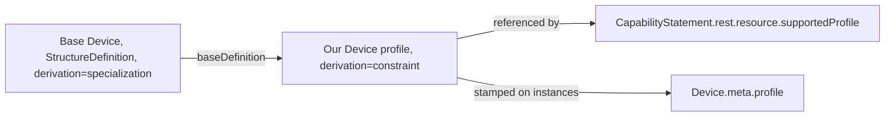

# FHIR R4 profiling: defining a new Device profile

Source: `docs/reference/claude/fhir-profiling.md` (sources: `raw/fhir-r4/profiling.md`, `structuredefinition.md`, `elementdefinition.md`, `extensibility.md`, `conformance-rules.md`, `conformance-module.md`, `implementationguide.md`, `valueset.md`), `docs/reference/claude/fhir-terminology-resources.md` (sources: `raw/fhir-r4/valueset.md`, `codesystem.md`).

## Why this matters for the admin / doctor / patient / device system

SATUSEHAT has no `Device` profile at all in the reference corpus — the device-monitoring system we are building has to define its own StructureDefinition for the new measurement device from base FHIR R4. That means every rule in this file is not background reading but a direct to-do list: this is how we formally say "our device readings must carry a serial number, a status, and an owning patient" in a way any FHIR-aware tool can check. The terminology resources (`ValueSet`, `CodeSystem`) are what let that profile bind its coded elements (the vital-sign LOINC codes, the device type) to a defined, checkable set of values instead of free text.

## Profile vs. base

A **profile** is "a set of constraints on a resource," authored as a `StructureDefinition` with `derivation = constraint`. Profiling can only narrow what the base resource allows — restrict cardinality, rule an element out entirely (`max = 0`), fix or pattern a value, restrict which types a choice element may take, require a nested reference to conform to another profile, or bind to a tighter value set. A profile can never add a brand-new element, rename anything, or override the base's meaning: "It must be safe to process a resource without knowing the profile." Cardinality can only move toward being *more* restrictive — base `0..1` may become `0..1` (unchanged), `0..0`, or `1..1`, but never `0..*`.



## StructureDefinition, in a worked shape

A profile StructureDefinition is identified by its own canonical `url`, states what it constrains (`type`, `baseDefinition`), and carries a `differential` — the sparse list of only the elements it actually restricts — and, for operational use, a fully expanded `snapshot`.

```json
{
  "resourceType": "StructureDefinition",
  "url": "https://example.org/fhir/StructureDefinition/monitoring-device",
  "name": "MonitoringDevice",
  "status": "active",
  "kind": "resource",
  "abstract": false,
  "type": "Device",
  "baseDefinition": "http://hl7.org/fhir/StructureDefinition/Device",
  "derivation": "constraint",
  "differential": {
    "element": [
      { "id": "Device.identifier", "path": "Device.identifier", "min": 1 },
      { "id": "Device.status", "path": "Device.status", "min": 1 },
      { "id": "Device.patient", "path": "Device.patient", "min": 1 }
    ]
  }
}
```

## Binding strengths, and how a profile may tighten them

| Strength | Meaning | A profile may narrow it to |
|---|---|---|
| required | the concept SHALL be from the value set | required only |
| extensible | SHALL be from the value set if it covers the concept; otherwise another coding is allowed | required, extensible |
| preferred | encouraged, not required | required, extensible, preferred |
| example | not expected to be drawn from at all | any of the four |

A profile can never make a code valid that the base value set rejects — narrowing is the only direction allowed. This is exactly the same rule used elsewhere in this compilation whenever a SATUSEHAT-style constraint tightens a base R4 binding (see `validity-review.md`).

## Extensions: adding data that has no home in base Device

Anything the new device profile needs to record that has no existing Device element — say, a calibration interval specific to our hardware — must be a formally defined **extension**: its own `StructureDefinition` with `kind = complex-type`, `type = Extension`, `baseDefinition` pointing at the base Extension type, and a `context` saying where it may be used. An extension carries either a `value[x]` or nested sub-extensions, never both. If ignoring the extension would change how a resource must be interpreted, it has to be a *modifier* extension, which every consumer is required to either understand or explicitly refuse to process.

## Steps to define a new Device profile

1. Create a `StructureDefinition` with a canonical `url`, `name`, `status`, `kind = resource`, `abstract = false`, `type = Device`, `baseDefinition = http://hl7.org/fhir/StructureDefinition/Device`, and `derivation = constraint`.
2. Author a `differential` listing only the elements you are constraining — the root element is not needed, and the base element order must be preserved. Every listed element needs a `path` and an `id`.
3. Only use paths that already exist in base `Device` — no new elements, no renaming.
4. Tighten cardinality only in the directions base FHIR allows (for example `0..1` → `1..1` or `0..0`; `0..*` → `0..1`, `1..1`, `1..*`, or `0..0`).
5. Use `fixed[x]` for an exact required value or `pattern[x]` for "at least these properties must match" — never both on the same element.
6. Bindings are only allowed on `code`, `Coding`, `CodeableConcept`, `Quantity`, `string`, or `uri` elements, and the strength may only tighten per the table above.
7. Restrict what a `Reference` element may point at with `type.targetProfile`.
8. For repeating elements you need to distinguish (for example several `identifier` entries), use slicing: the first entry declares a discriminator and slicing rules, and every following entry carries a `sliceName`.
9. For data with no home in base `Device`, define a separate extension `StructureDefinition` (see above) and slice `Device.extension` on its `url` in the profile.
10. Mark `mustSupport = true` on elements every conformant implementation must actually use, and document in `description` what "support" means for each.
11. Add any extra invariants as `constraint` entries (`key`, `severity`, `human`, `expression`) — base constraints can never be removed, only added to.
12. Generate the `snapshot` — a fully expanded element list with definition, `min`, `max`, and `base` on every element — since "operational systems should always have the snapshot view populated."
13. Package the profile (and any extensions) into an `ImplementationGuide`, declare it in `CapabilityStatement.rest.resource.supportedProfile`, stamp created instances with `meta.profile`, and support search by `_profile`.

Read next: `15-fhir-workflow.md`
