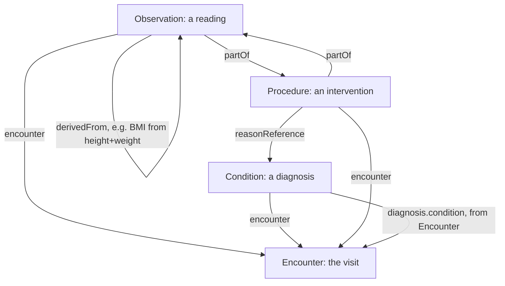

# FHIR R4 workflow patterns

Source: `docs/reference/claude/fhir-workflow.md` (sources: `raw/fhir-r4/workflow.md`, `clinicalsummary-module.md`, `observation.md`, `procedure.md`, `encounter.md`, `condition.md`).

## Why this matters for the admin / doctor / patient / device system

The workflow page is what tells us that our clinical resources — Observation, Condition, Procedure, Encounter — all belong to the same category ("events": something that has been done) and standardises how they reference each other, even though FHIR itself "does not need to be used for the execution of workflow." Our server does not need a workflow engine; it needs to get the reference wiring between these event resources right, because that wiring is what lets a doctor's UI reconstruct "everything that happened during this visit" from a single Encounter id, and what lets a device-sourced Observation say which visit it belongs to.

## Three categories, and where our resources fall

FHIR groups workflow-related resources into three patterns:

| Category | Meaning | Examples from our scope |
|---|---|---|
| Definitions | something that *could* happen, described independent of any one patient or time (a protocol, an order set) | none in our scope |
| Requests | a proposal, plan, or order for something to be done | none in our scope (we do not model ordering) |
| Events | something that *has* been done, or is being done | Observation, Condition, Procedure, Encounter |

Device, Patient, Practitioner, Organization, Location, RelatedPerson, and Person are **not** in any of these three lists — the source explains that many resources "describe entities and roles... or infrastructure" and are simply outside the workflow patterns altogether. For our design this means: model the clinical visit as event resources referencing each other, and treat the identity/administrative resources as the fixed context those events point into, not as part of the workflow chain itself.

## How the event resources reference each other

Encounter is the hub. Every other event resource in our scope carries a 0..1 `encounter` reference back to it:



A worked example of the doctor's flow, taken straight from the Claude view: `Condition` is posted first (`code`, `subject`, `encounter`, `asserter`), then `Procedure` (`reasonReference` pointing at the Condition, `encounter`, `performer.actor`), then the Encounter itself is updated (`PUT`) to add `diagnosis.condition` and `diagnosis.rank`, closing the loop back from the visit to its diagnoses.

```json
{
  "resourceType": "Condition",
  "code": { "coding": [ { "system": "http://hl7.org/fhir/sid/icd-10", "code": "C47.0" } ] },
  "subject": { "reference": "Patient/100000030009" },
  "encounter": { "reference": "Encounter/2b2d0a3e-082a-4fe9-ae13-da9c3b5e422f" }
}
```

Beyond the `encounter` link, three more standardised relationships appear across event resources: a reference to what the event was **based on** (a plan or order — `Observation.basedOn`, `Procedure.basedOn`, `Encounter.basedOn`; Condition has none of these), a reference to what the event is **part of**, forming parent-child groupings (`Observation.partOf`, `Procedure.partOf`, `Encounter.partOf`), and — for Observation specifically — `hasMember` (grouping several independently-usable Observations into a panel, like the Vital Signs Panel) and `derivedFrom` (linking a computed value, like BMI, back to the height and weight Observations it came from).

## Device-sourced vital signs in this pattern

A device-sourced Observation is, in workflow terms, simply an event with no request behind it — the reading was not "ordered," it happened because the device took it. It still participates fully in the event-linking rules above: it can carry `encounter` (which visit it belongs to), `partOf` (if it was taken during a recorded Procedure), and `device` (which physical instrument produced it, per `13-fhir-resources-for-monitoring.md`). Nothing in the workflow page requires a Request or Definition resource for this to work — our admin/doctor/patient/device scope only needs the event pattern.

Read next: `validity-review.md`
